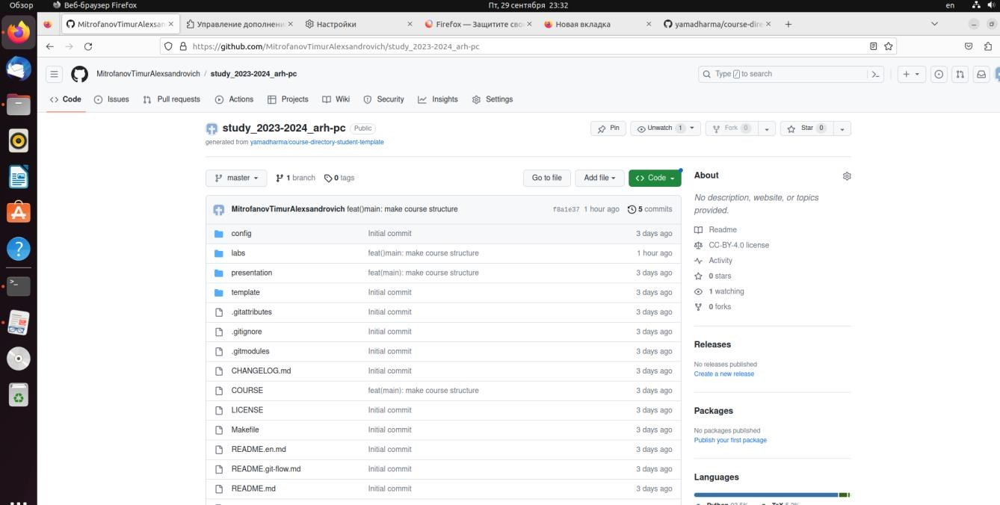

---
## Front matter
title: "Отчёта по лабораторной работе №2"
subtitle: "Система контроля версии Git"
author: "Тимур Митрофанов Александрович"

## Generic otions
lang: ru-RU
toc-title: "Содержание"

## Bibliography
bibliography: bib/cite.bib
csl: pandoc/csl/gost-r-7-0-5-2008-numeric.csl

## Pdf output format
toc: true # Table of contents
toc-depth: 2
lof: true # List of figures
lot: true # List of tables
fontsize: 12pt
linestretch: 1.5
papersize: a4
documentclass: scrreprt
## I18n polyglossia
polyglossia-lang:
  name: russian
  options:
	- spelling=modern
	- babelshorthands=true
polyglossia-otherlangs:
  name: english
## I18n babel
babel-lang: russian
babel-otherlangs: english
## Fonts
mainfont: PT Serif
romanfont: PT Serif
sansfont: PT Sans
monofont: PT Mono
mainfontoptions: Ligatures=TeX
romanfontoptions: Ligatures=TeX
sansfontoptions: Ligatures=TeX,Scale=MatchLowercase
monofontoptions: Scale=MatchLowercase,Scale=0.9
## Biblatex
biblatex: true
biblio-style: "gost-numeric"
biblatexoptions:
  - parentracker=true
  - backend=biber
  - hyperref=auto
  - language=auto
  - autolang=other*
  - citestyle=gost-numeric
## Pandoc-crossref LaTeX customization
figureTitle: "Рис."
tableTitle: "Таблица"
listingTitle: "Листинг"
lofTitle: "Список иллюстраций"
lotTitle: "Список таблиц"
lolTitle: "Листинги"
## Misc options
indent: true
header-includes:
  - \usepackage{indentfirst}
  - \usepackage{float} # keep figures where there are in the text
  - \floatplacement{figure}{H} # keep figures where there are in the text
---

# Цель работы

Целью работы является изучить идеологию и применение средств контроля версий. Приобрести практические навыки по работе с системой git

# Ход выполнения лабораторной работы

При помощи терминала делаем базовую настройку *git*. При помощи первых двух команд указывем данные о владельце рипозитория. Затем производим настройку utf-8 в выводе сообщений git. Даём имя начальной ветке – master. А также двумя последними командами настраиваем параметры *autocrlf* и *safecrlf*.(Рис. 001)

{width=100%}

Теперь создаём SSH ключ при помощи команды ***ssh-keygen***. Открываем и копируем только что созданный ключ командами ***cat*** и ***xclip***. Затем вставляем ключна сайте (рис 002, рис 003, рис 004)

{width=100%}

{width=100%}

{width=100%}

При помощи команды ***mkdir*** создали каталог для предмета “Архитектура компьютеров”. (рис 005)

{width=100%}

Теперь создаём репозиторий курса на основе шаблона *https://github.com/yamadharma/course-directory-student-template*. (Рис 006, рис 007)

{width=100%}

{width=100%}

Переходим в ранее созданный каталог предмета и клонируем созданный репозиторий(рис 008, рис 009)

{width=100%}

{width=100%}

После чего переходим в каталог курса “arch-pc”(рис 010), удаляем лишние файлы формата *json*(рис 011). Затем добавляем необходимые каталоги(рис 012) и в заключении отправляем файлы на сервер(рис 013, 014)

{width=100%}

{width=100%}

{width=100%}

{width=100%}

{width=100%}

# Задания для самостоятельной работы

При помощи libreOffice был создан файл отчёта и размещён в соответствующем каталоге lab2 рабочего пространства(рис 015)

{width=100%}

Затем в каталог lab1 был перемещён отчёт о предидущеё лабораторной работе(рис 016)

{width=100%}

В завершении добавленые файлы были загружены на github(рис 017, рис 018, рис 019)

{width=100%}

{width=100%}

{width=100%}

# Выводы

Сегодня я изучил идеологию и применение средств контроля версий.
Приобрёл практические навыки по работе с системой git.

