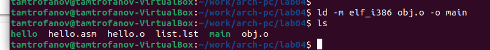

---
## Front matter
title: "Лабораторная работа №4"
subtitle: "Создание и процесс
обработки программ на языке ассемблера NASM"
author: "Митрофанов Тимур Александрович"

## Generic otions
lang: ru-RU
toc-title: "Содержание"

## Bibliography
bibliography: bib/cite.bib
csl: pandoc/csl/gost-r-7-0-5-2008-numeric.csl

## Pdf output format
toc: true # Table of contents
toc-depth: 2
lof: true # List of figures
fontsize: 12pt
linestretch: 1.5
papersize: a4
documentclass: scrreprt
## I18n polyglossia
polyglossia-lang:
  name: russian
  options:
	- spelling=modern
	- babelshorthands=true
polyglossia-otherlangs:
  name: english
## I18n babel
babel-lang: russian
babel-otherlangs: english
## Fonts
mainfont: PT Serif
romanfont: PT Serif
sansfont: PT Sans
monofont: PT Mono
mainfontoptions: Ligatures=TeX
romanfontoptions: Ligatures=TeX
sansfontoptions: Ligatures=TeX,Scale=MatchLowercase
monofontoptions: Scale=MatchLowercase,Scale=0.9
## Biblatex
biblatex: true
biblio-style: "gost-numeric"
biblatexoptions:
  - parentracker=true
  - backend=biber
  - hyperref=auto
  - language=auto
  - autolang=other*
  - citestyle=gost-numeric
## Pandoc-crossref LaTeX customization
figureTitle: "Рис."
tableTitle: "Таблица"
listingTitle: "Листинг"
lofTitle: "Список иллюстраций"
lolTitle: "Листинги"
## Misc options
indent: true
header-includes:
  - \usepackage{indentfirst}
  - \usepackage{float} # keep figures where there are in the text
  - \floatplacement{figure}{H} # keep figures where there are in the text
---

# Цель работы

Освоение процедуры компиляции и сборки программ, написанных на ассемблере NASM.

# Выполнение лабораторной работы

При помощи стадндартных команд создал папку *lab04* по пути ***~/work/arch-pc/lab04***, а затем открыл данный каталог (рис. @fig:001).

{#fig:001}

При помощи стандартных команд создаю и открываю в тестовом редакторе файл *hello.asm*(рис. @fig:002)

{#fig:002}

Затем ввожу текст будущей программы(рис. @fig:003)

{#fig:003}

При помощи команды **nasm -f elf hello.asm** превращаем текст команды в обЪективный код.(рис. @fig:004)

{#fig:004}

При помощи расширенной команды **nasm -o obj.o -f elf -g -l list.lst hello.asm** превращаю текст команды в обЪективный код в файли под названием *obj.o*, а также создаю файл листинга *list.lst*.(рис. @fig:005)

{#fig:005}

Чтобы получить исполняемую программу с названием *hello* ввожу команду ***ld -m elf_i386 hello.o -o hello***(рис. @fig:006)

{#fig:006}

Чтобы получить исполняемую программу с названием *main* из файла *obj.o* вводуж команду ***ld -m elf_i386 obj.o -o main***(рис. @fig:007)

{#fig:007}

Привожу в исполнение файл *hello*(рис. @fig:008)

{#fig:008}

# Задание для самостоятельной работы

Спомощью команды **cp** копирую файл *hello.asm* в файл *lab4.asm*(рис. @fig:009)

{#fig:009}

Произвожу необходимые изменения в файле *lab4.asm*(рис. @fig:010)

{#fig:010}

С помощью команд **nasm** и **ld** произвожу компановку файла *lab4.asm* в объективный код в программе *lab4*. А затем привожу его в исполнение(рис. @fig:011)

{#fig:011}

Копирую файлы *hello.asm* и *lab4.asm* в ***~/work/study/2023-2024/"Архитектура компьютера"/arch-pc/labs/lab04/***(рис. @fig:012)

{#fig:012}

Отправка изменений в ветке на сервер

{#fig:013}

# Выводы

сегодгя я освоенил процедуры компиляции и сборки программ, написанных на ассемблере NASM.

:::
