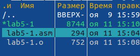
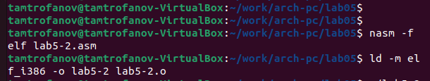

---
## Front matter
title: "Лабораторная работа №5"
subtitle: "Основы работы с Midnight Commander (mc). Структура программы на языке ассемблера NASM. Системные вызовы в ОС GNU Linux"
author: "Митрофанов Тимур Александрович"

## Generic otions
lang: ru-RU
toc-title: "Содержание"

## Bibliography
bibliography: bib/cite.bib
csl: pandoc/csl/gost-r-7-0-5-2008-numeric.csl

## Pdf output format
toc: true # Table of contents
toc-depth: 2
lof: true # List of figures
fontsize: 12pt
linestretch: 1.5
papersize: a4
documentclass: scrreprt
## I18n polyglossia
polyglossia-lang:
  name: russian
  options:
	- spelling=modern
	- babelshorthands=true
polyglossia-otherlangs:
  name: english
## I18n babel
babel-lang: russian
babel-otherlangs: english
## Fonts
mainfont: PT Serif
romanfont: PT Serif
sansfont: PT Sans
monofont: PT Mono
mainfontoptions: Ligatures=TeX
romanfontoptions: Ligatures=TeX
sansfontoptions: Ligatures=TeX,Scale=MatchLowercase
monofontoptions: Scale=MatchLowercase,Scale=0.9
## Biblatex
biblatex: true
biblio-style: "gost-numeric"
biblatexoptions:
  - parentracker=true
  - backend=biber
  - hyperref=auto
  - language=auto
  - autolang=other*
  - citestyle=gost-numeric
## Pandoc-crossref LaTeX customization
figureTitle: "Рис."
tableTitle: "Таблица"
listingTitle: "Листинг"
lofTitle: "Список иллюстраций"

lolTitle: "Листинги"
## Misc options
indent: true
header-includes:
  - \usepackage{indentfirst}
  - \usepackage{float} # keep figures where there are in the text
  - \floatplacement{figure}{H} # keep figures where there are in the text
---

# Цель работы

Приобретение практических навыков работы в Midnight Commander. Освоение инструкций языка ассемблера mov и int.

# Выполнение лабораторной работы

При помощи команды ***mc*** введённой в терминал попал в *Midnight Commander* (рис. @fig:001).

{#fig:001}

При помощи стандартных клавиш управления перешел в каталог *~/work/arch-pc* (рис. @fig:002).

{#fig:002}

Создал подкаталог *lab05* (рис. @fig:003).

{#fig:003}

При помощи команды ***touch*** создал файл *lab5-1.asm* (рис. @fig:004).

{#fig:004}

Занёс представленную в материале к лабораторной работе программу в файл *lab5-1.asm* (рис. @fig:005).

{#fig:005}

При помощи ряда команд скомпелировал файл *lab5-1.asm*(рис. @fig:006) (рис. @fig:007) и запустил его(рис. @fig:008).

{#fig:006}

{#fig:007}

{#fig:008}

Скачал приложенный к лабораторной работе файл с ТУИС (рис. @fig:009).

{#fig:009}

При помощи *Midnight Commander* перенёс скаченный файл в папку лабораторной работы с кодами программ (рис. @fig:010).

{#fig:010}

Из файла *lab5-1.asm* создал файл *lab5-2.asm* (рис. @fig:011).

{#fig:011}

Внёс изменения в файл как было указано в лабораторной работе(рис. @fig:012).

{#fig:012}

Затем скпомпелировал файл (рис. @fig:013) и запустил его (рис. @fig:014)

{#fig:013}

{#fig:014}

Заменил команду ***sprintLF*** на ***sprint***(рис. @fig:015).

{#fig:015}

После чего скомпелировал (рис. @fig:016) и вновь запустил его (рис. @fig:017). Изменяние по сравнению с предидущим разом заключается в том, что в последний раз не произошло переноса строки т.к. команда ***sprint*** этого не предусматривает.

{#fig:016}

{#fig:017}

# Выполнение заданий для самостоятельной работы

Создал файл *lab5-1с.asm* на основе *lab5-1.asm*(рис. @fig:018)

{#fig:018}

Внёс изменения в файл  *lab5-1с.asm*(рис. @fig:019).

{#fig:019}

После чего скомпелировал (рис. @fig:020) и запустил его (рис. @fig:021).

{#fig:020}

{#fig:021}

Создал файл *lab5-2с.asm* и внёс изменения в него (рис. @fig:022).

{#fig:022}

После чего скомпелировал и запустил его (рис. @fig:023). 

{#fig:023}

# Выводы

Сегодня я приобрёл практические навыки работы в Midnight Commander. Освоил инструкций языка ассемблера mov и int.

:::
