---
## Front matter
title: "Лабораторная работа №7."
subtitle: "Команды безусловного и
условного переходов в Nasm. Программирование ветвлений."
author: "Митрофанов Тимур Александрович"

## Generic otions
lang: ru-RU
toc-title: "Содержание"

## Bibliography
bibliography: bib/cite.bib
csl: pandoc/csl/gost-r-7-0-5-2008-numeric.csl

## Pdf output format
toc: true # Table of contents
toc-depth: 2
lof: true # List of figures
fontsize: 12pt
linestretch: 1.5
papersize: a4
documentclass: scrreprt
## I18n polyglossia
polyglossia-lang:
  name: russian
  options:
	- spelling=modern
	- babelshorthands=true
polyglossia-otherlangs:
  name: english
## I18n babel
babel-lang: russian
babel-otherlangs: english
## Fonts
mainfont: PT Serif
romanfont: PT Serif
sansfont: PT Sans
monofont: PT Mono
mainfontoptions: Ligatures=TeX
romanfontoptions: Ligatures=TeX
sansfontoptions: Ligatures=TeX,Scale=MatchLowercase
monofontoptions: Scale=MatchLowercase,Scale=0.9
## Biblatex
biblatex: true
biblio-style: "gost-numeric"
biblatexoptions:
  - parentracker=true
  - backend=biber
  - hyperref=auto
  - language=auto
  - autolang=other*
  - citestyle=gost-numeric
## Pandoc-crossref LaTeX customization
figureTitle: "Рис."
tableTitle: "Таблица"
listingTitle: "Листинг"
lofTitle: "Список иллюстраций"
lolTitle: "Листинги"
## Misc options
indent: true
header-includes:
  - \usepackage{indentfirst}
  - \usepackage{float} # keep figures where there are in the text
  - \floatplacement{figure}{H} # keep figures where there are in the text
---

# Цель работы

Изучение команд условного и безусловного переходов. Приобретение навыков написания программ с использованием переходов. Знакомство с назначением и структурой файла листинга.

# Выполнение лабораторной работы

Создал подкаталог *lab07*, перешел в него и в нём создал файл *lab7-1.asm* (рис. @fig:001).

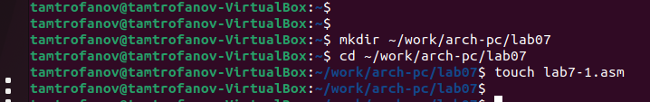{#fig:001}

Ввёл тест программы из листинга 7.1 в файл *lab7-1.asm* (рис. @fig:002). Затем создал исполняемый файл и проверил его работу (рис. @fig:003)

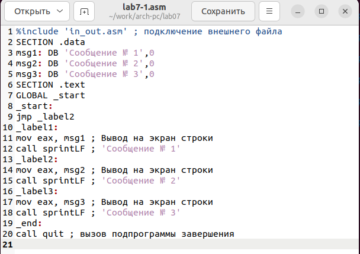{#fig:002}

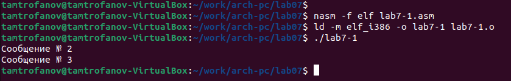{#fig:003}

Изменил код в файле *lab7-1.asm* в соответствии с листингом 7.2 (рис. @fig:004). Повторно создал исполняемый файл и проверил его работу (рис. @fig:005).

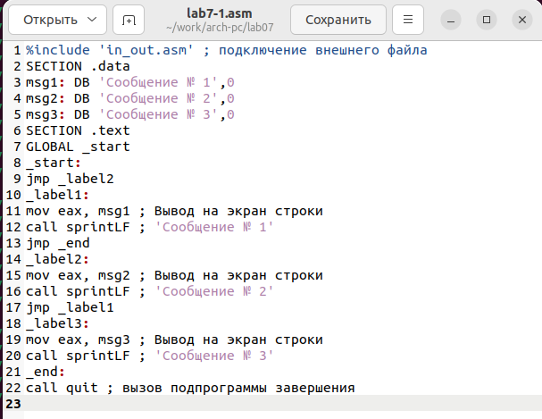{#fig:004}

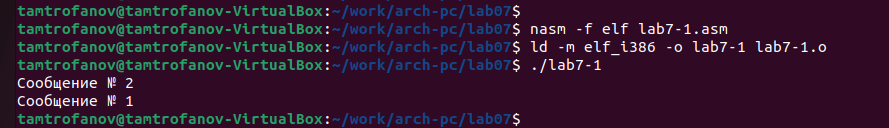{#fig:005}

Вновь изменил программу (рис. @fig:006). Повторно создал исполняемый файл и проверил его работу (рис. @fig:007).

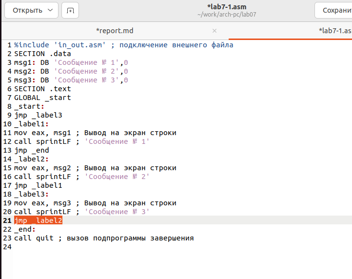{#fig:006}

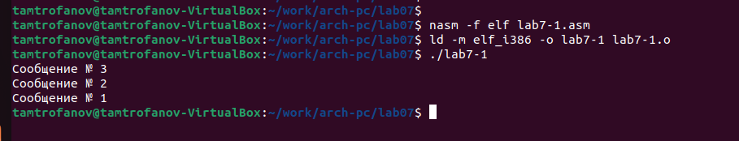{#fig:007}

Создал файл *lab7-2.asm* (рис. @fig:008). Внес код из листинга 7.3 в файл *lab7-2.asm* (рис. @fig:009). Затем создал исполняемый файл и проверил его для нескольких значений (рис. @fig:010).

{#fig:008}

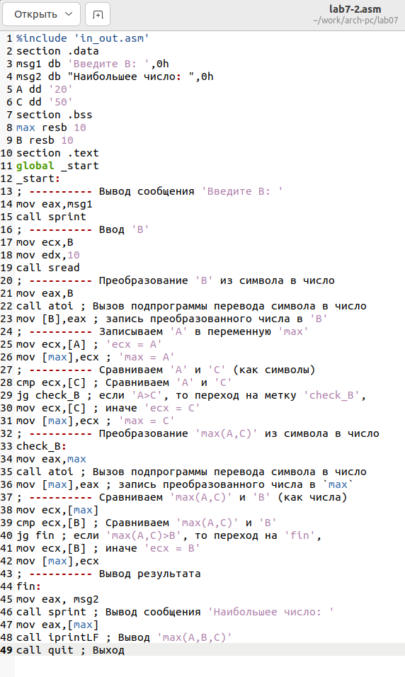{#fig:009}

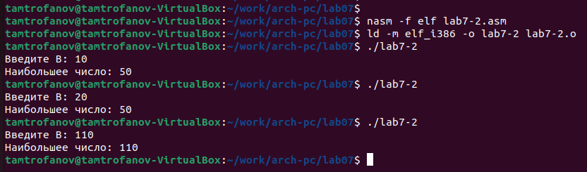{#fig:010}

Создал файл листинга для файла *lab7-2.asm* (рис. @fig:011). Открыл его с помщью *mcedit* (рис. @fig:012).

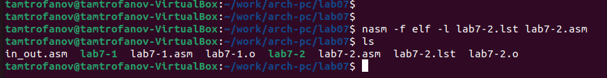{#fig:011}

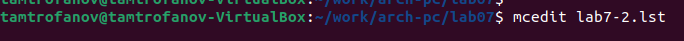{#fig:012}

Три строчки выбранных мною следующее (рис. @fig:013):

 - **45** - строчка, **00000159** адрес, **B8[13000000]** - машинный код, **mov eax, msg2** - исходный тест программы. В котором записывается адрес *msg2* в *EAX*.
 - **46** - строчка, **0000015E** адрес, **E8ACFEFFFF** - машинный код, **call sprint** - исходный тест программы. В котором вызывается функция *sprint*. Она в свою очередь выводит собщение содержащееся в переменной *msg2*
 - **47** - строчка, **00000163** адрес, **A1[00000000]** - машинный код, **mov eax,[max]** - исходный тест программы. В котором записывается адрес переменной *[max]* в *EAX*.
 
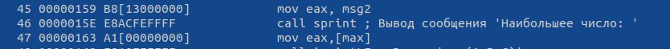{#fig:013}

Убрал один операнд из строки 14 файла *lab7-2.asm* (рис. @fig:014). И создал файл листинга в котором на строчке изменения появилась ошибка(рис. @fig:015).

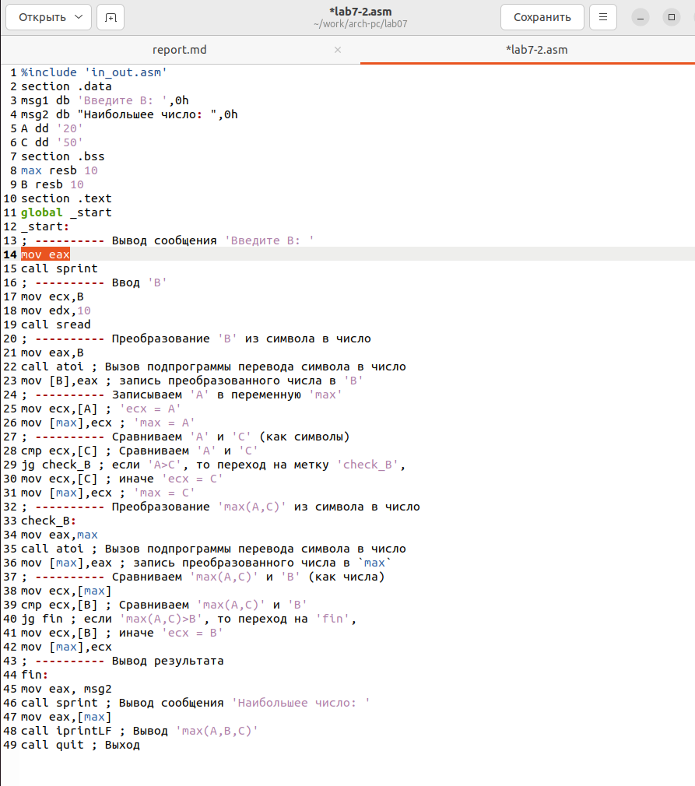{#fig:014}

{#fig:015}

# Задание для самостоятельной работы

Создаю новый файл *lav07-3.asm* (рис. @fig:016). За иснову программы взял предыдущий код из листинга 7.3. Внёс необходимые изменения в код (рис. @fig:017). Затем скомпилировал код и проверил его работу (рис. @fig:018).

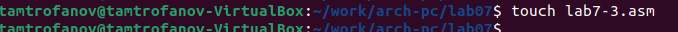{#fig:016}

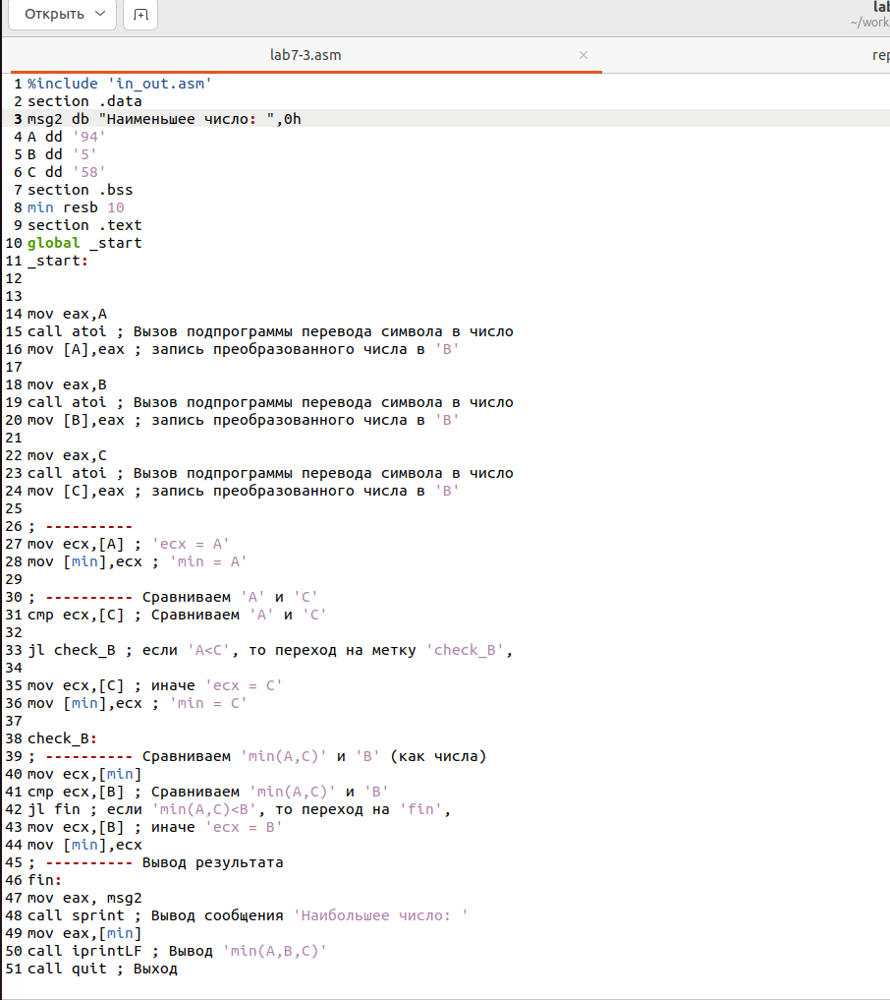{#fig:017}

{#fig:018}

***КОД ПРОГРАММЫ***


```

%include 'in_out.asm'
section .data
msg2 db "Наименьшее число: ",0h
A dd '94'
B dd '5'
C dd '58'
section .bss
min resb 10
section .text
global _start
_start:


mov eax,A
call atoi ; Вызов подпрограммы перевода символа в число
mov [A],eax ; запись преобразованного числа в 'B'

mov eax,B
call atoi ; Вызов подпрограммы перевода символа в число
mov [B],eax ; запись преобразованного числа в 'B'

mov eax,C
call atoi ; Вызов подпрограммы перевода символа в число
mov [C],eax ; запись преобразованного числа в 'B'

; ---------- 
mov ecx,[A] ; 'ecx = A'
mov [min],ecx ; 'min = A'

; ---------- Сравниваем 'A' и 'С'
cmp ecx,[C] ; Сравниваем 'A' и 'С'

jl check_B ; если 'A<C', то переход на метку 'check_B',

mov ecx,[C] ; иначе 'ecx = C'
mov [min],ecx ; 'min = C'

check_B:
; ---------- Сравниваем 'min(A,C)' и 'B' (как числа)
mov ecx,[min]
cmp ecx,[B] ; Сравниваем 'min(A,C)' и 'B'

jl fin
 
mov ecx,[B] ;иначе 'ecx = B'
mov [min],ecx
; ---------- Вывод результата
fin:
mov eax, msg2
call sprint ; Вывод сообщения 'Наибольшее число: '
mov eax,[min]
call iprintLF ; Вывод 'min(A,B,C)'
call quit ; Выход

```

Создаю новый файл *lav07-4.asm* (рис. @fig:019). Внёс код в файл (рис. @fig:020). Затем скомпилировал код и проверил его работу (рис. @fig:021).

{#fig:019}

{#fig:020}

{#fig:021}

***КОД ПРОГРАММЫ***


```

%include 'in_out.asm'
section .data
msg1 DB 'Введите x: ',0h
msg2 DB 'Введите a: ',0h
msg3: DB 'Ответ: ',0h

section .bss
x: RESB 80
a: RESB 80
r: RESB 80

section .text
global _start
_start:
mov eax,msg1
call sprint

mov ecx,x
mov edx,80
call sread

mov eax,x
call atoi
mov [x],eax

mov eax,msg2
call sprint

mov ecx,a
mov edx,80
call sread

mov eax,a
call atoi
mov [a],eax

mov eax, [x]
cmp eax, 3
je x_ravno_3

mov eax, [a]
add eax, 1
jmp res

x_ravno_3:
mov eax, [x]
imul eax,3

res:
mov [r],eax

fin:
mov eax,msg3
call sprint
mov eax,[r]
call iprintLF
call quit
```

# Выводы

Сегодня я изучил команды условного и безусловного переходов. Приобрёл навыкы написания программ с использованием переходов. Ознакомился с назначением и структурой файла листинга.

