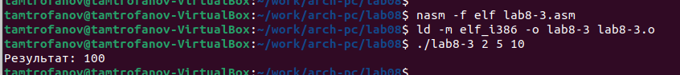

---
## Front matter
title: "Лабораторная работа №8."
subtitle: "Программирование цикла. Обработка аргументов командной строки."
author: "Митрофанов Тимур Александрович"

## Generic otions
lang: ru-RU
toc-title: "Содержание"

## Bibliography
bibliography: bib/cite.bib
csl: pandoc/csl/gost-r-7-0-5-2008-numeric.csl

## Pdf output format
toc: true # Table of contents
toc-depth: 2
lof: true # List of figures
fontsize: 12pt
linestretch: 1.5
papersize: a4
documentclass: scrreprt
## I18n polyglossia
polyglossia-lang:
  name: russian
  options:
	- spelling=modern
	- babelshorthands=true
polyglossia-otherlangs:
  name: english
## I18n babel
babel-lang: russian
babel-otherlangs: english
## Fonts
mainfont: PT Serif
romanfont: PT Serif
sansfont: PT Sans
monofont: PT Mono
mainfontoptions: Ligatures=TeX
romanfontoptions: Ligatures=TeX
sansfontoptions: Ligatures=TeX,Scale=MatchLowercase
monofontoptions: Scale=MatchLowercase,Scale=0.9
## Biblatex
biblatex: true
biblio-style: "gost-numeric"
biblatexoptions:
  - parentracker=true
  - backend=biber
  - hyperref=auto
  - language=auto
  - autolang=other*
  - citestyle=gost-numeric
## Pandoc-crossref LaTeX customization
figureTitle: "Рис."
tableTitle: "Таблица"
listingTitle: "Листинг"
lofTitle: "Список иллюстраций"
lolTitle: "Листинги"
## Misc options
indent: true
header-includes:
  - \usepackage{indentfirst}
  - \usepackage{float} # keep figures where there are in the text
  - \floatplacement{figure}{H} # keep figures where there are in the text
---

# Цель работы

Приобретение навыков написания программ с использованием циклов и обработкой аргументов командной строки.

# Выполнение лабораторной работы

Создал подкаталог *lab08* и в нём файла *lab8-1.asm* (рис. @fig:001).

{#fig:001}

В файл *lab8-1.asm* внёс код программы из листинга 8.1(рис. @fig:002). Скопмпелировал и проверерил работу программы из файла *lab8-1.asm*(рис. @fig:003).

{#fig:002}

{#fig:003}

Внёс необходимые изменения в файл *lab8-1.asm*(рис. @fig:004). Скопмпелировал и проверерил работу изменённый программы из файла *lab8-1.asm*(рис. @fig:005). В данном случае переход счётчика в цикле происхрдит через один, а соответсвенно и циклов в 2 раза меньше.

{#fig:004}

{#fig:005}

Внёс необходимые изменения в файл *lab8-1.asm*(рис. @fig:006). Скопмпелировал и проверерил работу изменённый программы из файла *lab8-1.asm*(рис. @fig:007). В данном случае число переходов соответсвует числу введённому с клавиатуры.

{#fig:006}

{#fig:007}

Создал файл *lab8-2.asm*(рис. @fig:008).

{#fig:008}

В файл *lab8-2.asm* внёс код программы из листинга 8.2(рис. @fig:009). Скопмпелировал и проверерил работу программы из файла *lab8-2.asm*(рис. @fig:010). Программой были обработаны все 3 аргумента.

{#fig:009}

{#fig:010}

Создал файл *lab8-3.asm*(рис. @fig:011).

{#fig:011}

В файл *lab8-3.asm* внёс код программы из листинга 8.3(рис. @fig:012). Скопмпелировал и проверерил работу изменённый программы из файла *lab8-3.asm*(рис. @fig:013).

{#fig:012}

{#fig:013}

Внёс необходимые изменения в файл *lab8-3.asm* соответствии с заданием(рис. @fig:014). Скопмпелировал и проверерил работу изменённый программы из файла *lab8-3.asm*(рис. @fig:015).

{#fig:014}

{#fig:015}

# Задание для самостоятельной работы

Создал файл *lab8-4.asm*(рис. @fig:016).

{#fig:016}

В файл *lab8-4.asm* внёс уод соответсвующий формуле моего варианта (3 вариант)(рис. @fig:017). Скопмпелировал и проверерил работу программы из файла *lab8-4.asm*(рис. @fig:018).

{#fig:017}

```
%include 'in_out.asm' 
SECTION .data
msg db "Результат: ",0
SECTION .text
global _start

_start: 
pop ecx  
pop edx  
sub ecx,1  
mov esi, 0 

next:
cmp ecx,0h 
jz _end  
pop eax 
call atoi
mov ebx,10
mul ebx
sub eax,5
add esi,eax
loop next 

_end: 
mov eax, msg 
call sprint
mov eax, esi 
call iprintLF 
call quit
```

{#fig:018}

# Выводы

Сегодня я приобрёл навыки написания программ с использованием циклов и обработкой аргументов командной строки.

