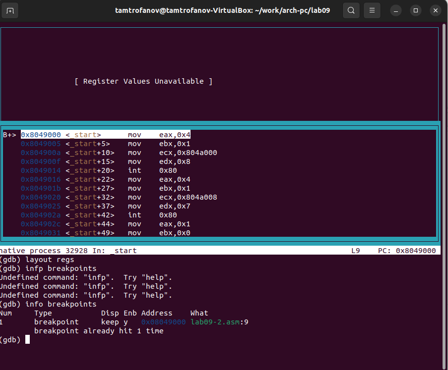
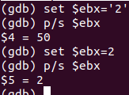
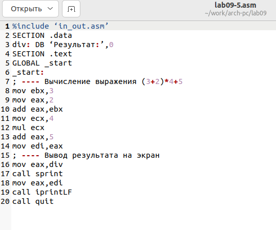

---
## Front matter
title: "Лабораторная работа №9."
subtitle: "Понятие подпрограммы. Отладчик GDB."
author: "Митрофанов Тимур Александрович"

## Generic otions
lang: ru-RU
toc-title: "Содержание"

## Bibliography
bibliography: bib/cite.bib
csl: pandoc/csl/gost-r-7-0-5-2008-numeric.csl

## Pdf output format
toc: true # Table of contents
toc-depth: 2
lof: true # List of figures
fontsize: 12pt
linestretch: 1.5
papersize: a4
documentclass: scrreprt
## I18n polyglossia
polyglossia-lang:
  name: russian
  options:
	- spelling=modern
	- babelshorthands=true
polyglossia-otherlangs:
  name: english
## I18n babel
babel-lang: russian
babel-otherlangs: english
## Fonts
mainfont: PT Serif
romanfont: PT Serif
sansfont: PT Sans
monofont: PT Mono
mainfontoptions: Ligatures=TeX
romanfontoptions: Ligatures=TeX
sansfontoptions: Ligatures=TeX,Scale=MatchLowercase
monofontoptions: Scale=MatchLowercase,Scale=0.9
## Biblatex
biblatex: true
biblio-style: "gost-numeric"
biblatexoptions:
  - parentracker=true
  - backend=biber
  - hyperref=auto
  - language=auto
  - autolang=other*
  - citestyle=gost-numeric
## Pandoc-crossref LaTeX customization
figureTitle: "Рис."
tableTitle: "Таблица"
listingTitle: "Листинг"
lofTitle: "Список иллюстраций"
lolTitle: "Листинги"
## Misc options
indent: true
header-includes:
  - \usepackage{indentfirst}
  - \usepackage{float} # keep figures where there are in the text
  - \floatplacement{figure}{H} # keep figures where there are in the text
---

# Цель работы

Приобретение навыков написания программ с использованием подпрограмм. Знакомство с методами отладки при помощи GDB и его основными возможностями.

# Выполнение лабораторной работы

Создал подкаталог *lab09*. В нём создал файл touch *lab09-1.asm* (рис. @fig:001). В созданный файл ввёл текст листинга 9.1(рис. @fig:002). Скомпелировал файл и проверил его работу (рис. @fig:003).

{#fig:001}

{#fig:002}

{#fig:003}

В соответствии с заданием создал подпрограмму которая отвечает за вычисления (рис. @fig:004). Скомпелировал файл и проверил его работу (рис. @fig:005).

{#fig:004}

{#fig:005}

Создал файл *lab09-2.asm* (рис. @fig:006). В созданный файл ввёл текст листинга 9.2 (рис. @fig:007). Для работы с GDB при создании исполняемого файла добавил ключ ***-g*** (рис. @fig:008).

{#fig:006}

{#fig:007}

{#fig:008}

Загрузил исполняемый файл в отладчик gdb и запустил его в нём (рис. @fig:009).

{#fig:009}

Установил брейкпоинт на метку _start и запустил программу (рис. @fig:010).

{#fig:010}

Посмотрел дисассимилированный код программы с помощью команды ***disassemble***, начиная с метки ***_start*** (рис. @fig:011).

{#fig:011}

Переключил на отображение команд с Intel’овским синтаксисом, введя команду ***set disassembly-flavor intel*** (рис. @fig:012).

{#fig:012}

***Перечил различия отображения синтаксиса машинных команд в режимах ATT и Intel.***

- В ATT имена регистров начинаются с символа %, а имена опрерандов с $, в то время как в intel используется привычный нам синтаксис.

Включил режим псевдографики для более удобного анализа программы (рис. @fig:013).

{#fig:013}

Получил данные о брейкпоинтах (рис. @fig:014). Добавил ещё один брейкпоинт и проверил его наличие (рис. @fig:015).

{#fig:014}

{#fig:015}

Выполнил 5 инструкций с помощью команды stepi (рис. @fig:016).

{#fig:016}

Посмотрел содержимое регистров при помощи команды info registers (рис. @fig:017).

{#fig:017}

Посмотрел значение переменной msg1 по имени (рис. @fig:018).

{#fig:018}

Посмотрел значение переменной msg2 по адресу (рис. @fig:019).

{#fig:019}

Измененил первыый символ переменной msg1 на ***h*** (рис. @fig:020).

{#fig:020}

Измененил первыый символ переменной msg2 на ***Q*** (рис. @fig:021).

{#fig:021}

Выведел в различных форматах значение регистра edx (рис. @fig:022).

{#fig:022}

С помощью команды ***set*** измените значение регистра *ebx* (рис. @fig:023).

{#fig:023}

***Объясните разницу вывода команд p/s $ebx.***

-  В первом случае мы переводим символ в строковой вид.

Завершил выполнение программы с помощью команды continue и выйшел из GDB с помощью команды quit (рис. @fig:024).

{#fig:024}

Скопировал файл *lab8-2.asm* в файл с именем *lab09-3.asm* и создал исполняемый файл (рис. @fig:025).

{#fig:025}

Загрузил исполняемый файл в отладчик, указав аргументы (рис. @fig:026).

{#fig:026}

установил точку остановки перед первой инструкцией в программе и запустил ее (рис. @fig:027).

{#fig:027}

Проверил сколько в стеке хранится переменных (рис. @fig:028).

{#fig:028}

Посмотрел остальные позиции стека (рис. @fig:029).

{#fig:029}

***Объясните, почему шаг изменения адреса равен 4 ([esp+4], [esp+8], [esp+12] и т.д.)***

- Так как занчение колличества аргументов равно 4

# Задание для самостоятельной работы

Создал файл *lab09-4.asm* (рис. @fig:030). Перенёс программу из лабораторной работы № 8 в файл и изменил в соответствии с заданием (рис. @fig:031). Создал исполнительный файл и проверил его работу (рис. @fig:032).

{#fig:030}

{#fig:031}

{#fig:032}

***КОД ПРОГРАММЫЙ***

```
%include 'in_out.asm'
 
SECTION .data
msg db "Результат: ",0
 
SECTION .text

global _start
_start:
pop ecx 
pop edx 
sub ecx,1  
mov esi,0
 
next:
cmp ecx,0h 
jz _end 
 
pop eax 
call atoi
call proga
loop next
 
_end: 
mov eax, msg 
call sprint
mov eax, esi 
call iprintLF 
call quit

proga:
mov ebx,10
mul ebx
sub eax,5
add esi,eax
ret
```

Создал файл *lab09-5.asm* (рис. @fig:033). Внёс уод из листинга 9.3 в файл (рис. @fig:034). Создал исполнительный файл с применением отладчика, загрузил в него этот файл, подготовил программу для работы в отладчике (поставил брейкпойт, подключил граф. интр.) (рис. @fig:035).

{#fig:033}

{#fig:034}

{#fig:035}

Пошагово выполня программу нашел ошибку в использовании неправильного регистра при умножении (рис. @fig:036).

{#fig:036}

Внёс необходимые изменения в файл *lab09-5.asm* (рис. @fig:037). Создал исполнительный файл и проверил его работу (рис. @fig:038).

{#fig:037}

{#fig:038}

***КОД ПРОГРАММЫЙ***
```
%include 'in_out.asm'
SECTION .data
div: DB 'Результат: ',0
SECTION .text
GLOBAL _start
_start:
; ---- Вычисление выражения (3+2)*4+5
mov ebx,3
mov eax,2
add eax,ebx
mov ecx,4
mul ecx
add eax,5
mov edi,eax
; ---- Вывод результата на экран
mov eax,div
call sprint
mov eax,edi
call iprintLF
call quit
```
# Выводы

Сегодня я приобрёл навыки написания программ с использованием подпрограмм. Познакомился с методами отладки при помощи GDB и его основными возможностями.

