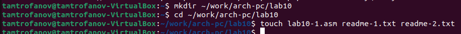
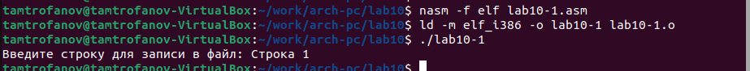
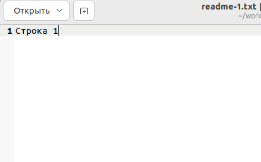
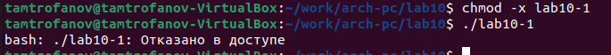
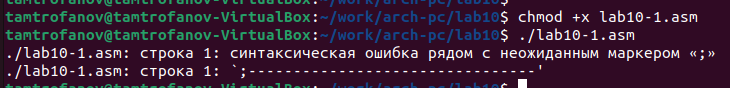
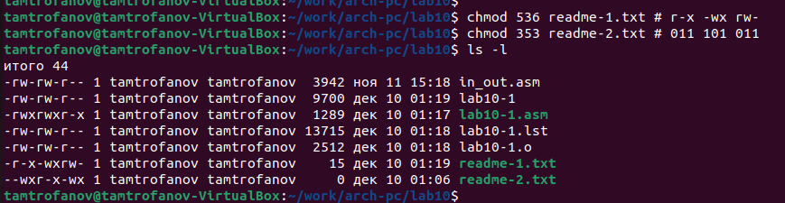
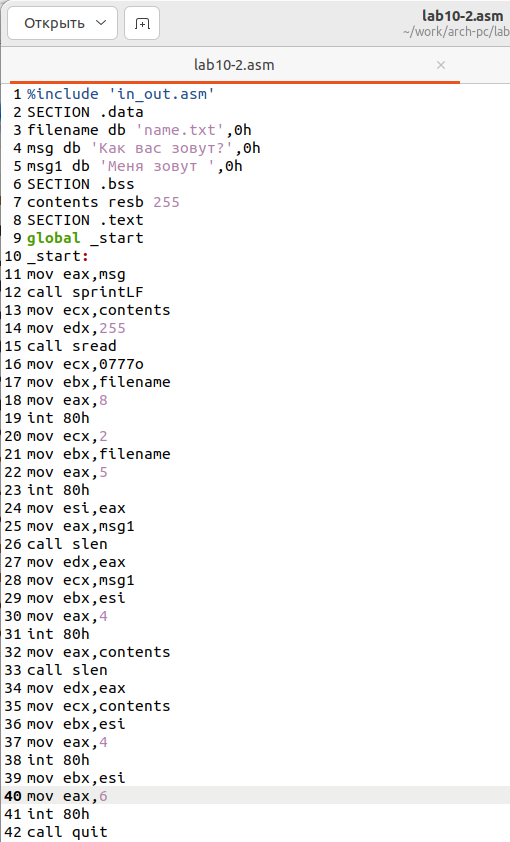
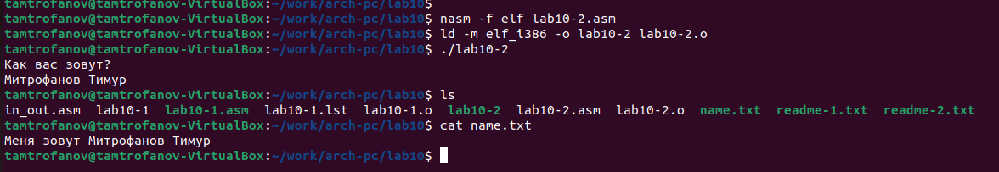

---
## Front matter
title: "Лабораторная работа №10."
subtitle: "Работа с файлами средствами Nasm"
author: "Митрофанов Тимур Александрович"

## Generic otions
lang: ru-RU
toc-title: "Содержание"

## Bibliography
bibliography: bib/cite.bib
csl: pandoc/csl/gost-r-7-0-5-2008-numeric.csl

## Pdf output format
toc: true # Table of contents
toc-depth: 2
lof: true # List of figures
fontsize: 12pt
linestretch: 1.5
papersize: a4
documentclass: scrreprt
## I18n polyglossia
polyglossia-lang:
  name: russian
  options:
	- spelling=modern
	- babelshorthands=true
polyglossia-otherlangs:
  name: english
## I18n babel
babel-lang: russian
babel-otherlangs: english
## Fonts
mainfont: PT Serif
romanfont: PT Serif
sansfont: PT Sans
monofont: PT Mono
mainfontoptions: Ligatures=TeX
romanfontoptions: Ligatures=TeX
sansfontoptions: Ligatures=TeX,Scale=MatchLowercase
monofontoptions: Scale=MatchLowercase,Scale=0.9
## Biblatex
biblatex: true
biblio-style: "gost-numeric"
biblatexoptions:
  - parentracker=true
  - backend=biber
  - hyperref=auto
  - language=auto
  - autolang=other*
  - citestyle=gost-numeric
## Pandoc-crossref LaTeX customization
figureTitle: "Рис."
tableTitle: "Таблица"
listingTitle: "Листинг"
lofTitle: "Список иллюстраций"
lolTitle: "Листинги"
## Misc options
indent: true
header-includes:
  - \usepackage{indentfirst}
  - \usepackage{float} # keep figures where there are in the text
  - \floatplacement{figure}{H} # keep figures where there are in the text
---

# Цель работы

Приобретение навыков написания программ для работы с файлами.

# Выполнение лабораторной работы

Создал подкаталог для выполнения лабораторной работы. Затем файлы *lab10-1.asm*, *readme-1.txt* и *readme-2.txt* (рис. @fig:001).

{#fig:001}

В файл *lab10-1.asm* внёс код из листинга 10.1. Создал исполняемый файл и проверил его работу (рис. @fig:002). Проверил содержимое файла *readme-1.txt* (рис. @fig:003).

{#fig:002}

{#fig:003}

С помощью команды chmod изменил права доступа к исполняемому файлу *lab10-1*, запретив его выполнение (рис. @fig:004). Из-за запрета на исполнение файл отказывается выполняться.

{#fig:004}

С помощью команды chmod изменил права доступа к файлу lab10-1.asm с исходным текстом программы, добавив права на исполнение (рис. @fig:005). После попытки запуска ввиду имения прав на исполнения файл пытается запуститься. Но так как он не является скомпелированным файлом возникают проблемы синтаксиса.

{#fig:005}

В соответствии с вариантом в таблице 10.4 предоставил права доступа к файлу readme-1.txt представленные в символьном виде, а для файла readme-2.txt – в двочном виде. Проверил правильность выполнения с помощью команды ls -l (рис. @fig:006).

{#fig:006}

# Задание для самостоятельной работы

Создал файл *lab10-2.asm* (рис. @fig:007). написал программу соответствующию заданию (рис. @fig:008). Скомпелировал файл и проверил его работу (рис. @fig:009).

{#fig:007}

{#fig:008}

{#fig:009}

```
%include 'in_out.asm'
SECTION .data
filename db 'name.txt',0h
msg db 'Как вас зовут?',0h
msg1 db 'Меня зовут ',0h
SECTION .bss
contents resb 255
SECTION .text
global _start
_start:
mov eax,msg
call sprintLF
mov ecx,contents
mov edx,255
call sread
mov ecx,0777o
mov ebx,filename
mov eax,8
int 80h
mov ecx,2
mov ebx,filename
mov eax,5
int 80h
mov esi,eax
mov eax,msg1
call slen
mov edx,eax
mov ecx,msg1
mov ebx,esi
mov eax,4
int 80h
mov eax,contents
call slen
mov edx,eax
mov ecx,contents
mov ebx,esi
mov eax,4
int 80h
mov ebx,esi
mov eax,6
int 80h
call quit
```

# Выводы

Сегодня я риобрёл навыкы написания программ для работы с файлами.

